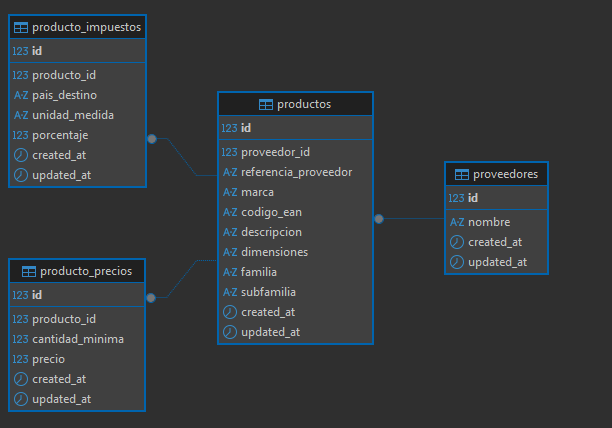

# Importador de Tarifas de Proveedores

## Cómo levantarlo

Clonar el repo, entrar a la carpeta y desde ahí:

- `composer install` para instalar las dependencias.
- Copiar el `.env.example` a `.env` y completar los datos de la base.
- `php artisan migrate` para correr las migraciones.
- `php artisan db:seed` para crear los proveedores base.
- `php artisan serve` para levantar el servidor.

Si lo querés probar por consola, hay un comando para eso:

```
php artisan importar:excel {archivo} {codigo} {id}
Ejemplo: php artisan importar:excel LUCGOMGLOBAL.xlsx lucgom_global 1  
```

## El modelo de datos

Opté por un modelo relacional, principalmente para evitar datos duplicados. Quedó dividido así:

- **Proveedores**: el punto de entrada.
- **Productos**: la información base, solo lo indispensable.
- **ProductoPrecios**: los precios por volumen. Es una relación 1:N, así que cada producto puede tener todos los tramos que necesite.
- **ProductoImpuestos**: lo separé para no mezclar los impuestos con la tabla de productos. De esta forma pueden variar según el país o la unidad sin afectar al resto.

Pensé en guardar los precios y los impuestos como JSON dentro de la misma tabla de productos, que hubiera sido más rápido de armar. Lo descarté porque después consultarlos se vuelve incómodo, filtrar por tramo de precio o por país de destino sobre un campo JSON es mucho más torpe que sobre tablas propias, y justo la consulta es una de las cosas que el sistema tiene que hacer bien. Separarlos en ProductoPrecios y ProductoImpuestos cuesta un poco más al principio pero deja todo consultable con queries normales.

## Decisiones de diseño


Toda la lógica de importación quedó en `ImportacionService`. Preferí mantenerla ahí en lugar de cargar el controlador y terminar con algo difícil de mantener.

Para el mapeo de columnas usé un array de configuración en `config/proveedores.php`. Para un sistema grande lo más prolijo sería una clase por proveedor, pero para el alcance de este challenge me pareció excesivo, y probablemente me quitaria demasiado tiempo. Teniendo todos los esquemas en un solo archivo es más fácil ver cómo viene cada proveedor y ajustarlo, en vez de repartir la lógica en muchos archivos casi vacíos.El service consume el array de forma transparente, así que si en algún momento un proveedor necesita una transformación más compleja, se puede pasar ese caso a una clase propia sin reescribir toda la importación.

La alternativa que tenía en la cabeza era una clase por proveedor implementando una interfaz común, que es lo más correcto cuando cada uno necesita lógica propia. Para lo que pide este challenge habría sido un montón de archivos para muy poca lógica real, así que lo dejé planteado como el camino al que migrar si la cosa se complica.

Para leer los Excel usé FastExcel en vez de PhpSpreadsheet directo. PhpSpreadsheet te da control total sobre el archivo (estilos, fórmulas, todo), pero acá no me interesa nada de eso, solo leer filas. FastExcel va por arriba de PhpSpreadsheet pero con una API más simple para justamente esto, y maneja mejor los archivos grandes sin cargarlos enteros en memoria.

Otra cosa que tuve en cuenta es que los Excel de los proveedores casi nunca vienen prolijos, falta una columna, hay celdas vacías, ese tipo de cosas. Para que un dato faltante no tire abajo toda la importación, manejé los campos con ?? e isset, de forma que si algo no está, el producto se guarda igual con lo que sí vino.

El endpoint de consulta tenía que aguantar miles de productos sin morir, así que cuidé dos frentes. Con with() evité el N+1, ese agujero donde sin querer terminás haciendo una consulta por cada fila. Y con paginate(50) me aseguré de no traer todo el catálogo de un saque, que es la forma más rápida de tumbar la respuesta o reventar la memoria.

## Tests

Hice tests de integración, sobre todo para asegurarme de que un cambio en `ImportacionService` no rompa la importación sin que me dé cuenta. Me enfoqué en dos cosas:

- Que un archivo se procese de punta a punta y quede bien guardado en la base.
- Que la API de consulta filtre correctamente por marca y referencia
No cubrí casos muy puntuales por una cuestión de tiempo, y preferí dejar sólido el flujo principal, que es el que se usa la mayor parte del tiempo.

## Mejoras pendientes

Con más tiempo, seguiría por acá:
- **Procesamiento en segundo plano.** Hoy, si el archivo es muy grande, el navegador queda esperando la respuesta del servidor. Lo ideal sería mover la importación a una Laravel Queue y avisarle al usuario cuando termina.
- **Mapeo más flexible.** El array cumple por ahora, pero me gustaría pasar a un esquema que permita definir reglas por columna (limpiar strings, formatear fechas, convertir unidades) de forma centralizada y sin ensuciar el service.
- **Validación de esquema.** Por ahora confío en que el Excel trae las columnas esperadas. Estaría bueno validar la estructura apenas llega el archivo y devolver un error claro si no respeta el formato, antes de insertar nada.
- **Búsqueda indexada.** Si el catálogo crece a millones de registros, las consultas con `WHERE` van a empezar a ser bastante mas lentas. Ahí integraría un motor de búsqueda indexado por atras, manteniendo el endpoint actual pero bajando los tiempos de respuesta.
- **Mejor trazabilidad.** Que si falla una fila dentro de un archivo de 10.000, quede registrado el motivo exacto y el proceso continúe con el resto, en lugar de abortar por completo.
- **Alta automática de proveedores en la importación.**. Hoy el proveedor tiene que existir antes de importar (se pasa su id y se valida contra la base). Me hubiera gustado que la importación pudiera crear el proveedor automáticamente si no existe, derivándolo del código de configuración, de forma que dar de alta un proveedor nuevo fuera simplemente agregar su bloque al config y tirar el Excel, sin pasos manuales previos. No lo incluí porque, en un escenario real, el alta de un proveedor suele ser un acto deliberado con más datos asociados y conviene separarla del flujo de importación, resolver bien ese equilibrio hubiese requerido mas tiempo.

## Supuestos que tomé

El enunciado deja algunas cosas abiertas, así que dejo anotado lo que interpreté en cada caso.

Familia y subfamilia las terminé tratando como opcionales. El enunciado no las marca así (sí marca EAN y descripción), pero después me encontré con archivos de ejemplo que directamente no las traen. Entre rechazar esa importación o dejar pasar el producto con esos campos en `null`, me quedé con lo segundo. Frenar una carga entera por un dato que el proveedor ni maneja me pareció peor que guardarla incompleta.

Con las unidades hice una simplificación. El contexto deja entrever que algún proveedor mete la unidad en el nombre de la columna (un `Peso (kg)`, por ejemplo), pero yo asumí que viene siempre en su propia columna o definida en las reglas del proveedor. Sacarla del encabezado se podría hacer sin tocar la estructura, sería una regla de mapeo más, pero para esta entrega lo dejé afuera.
